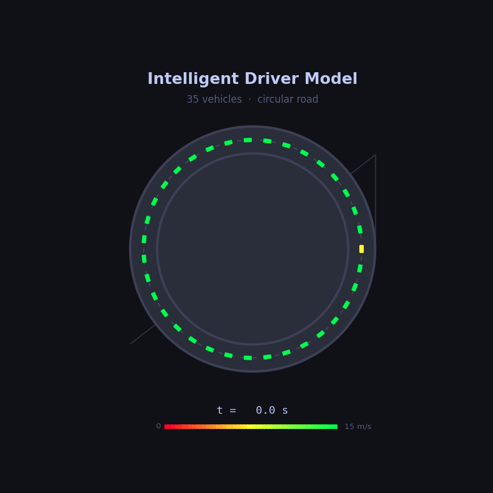
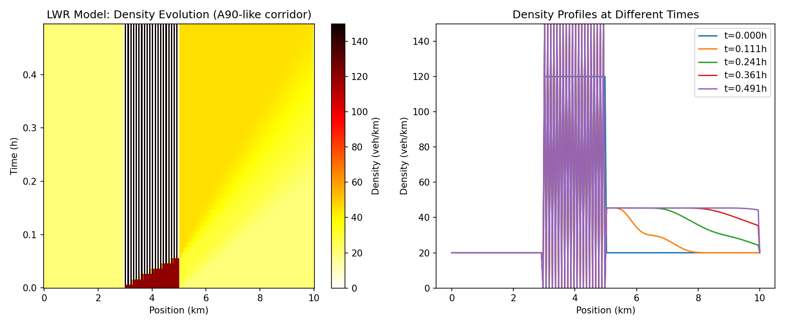
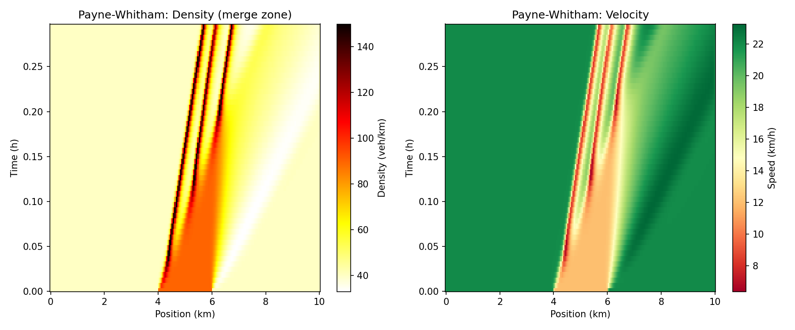
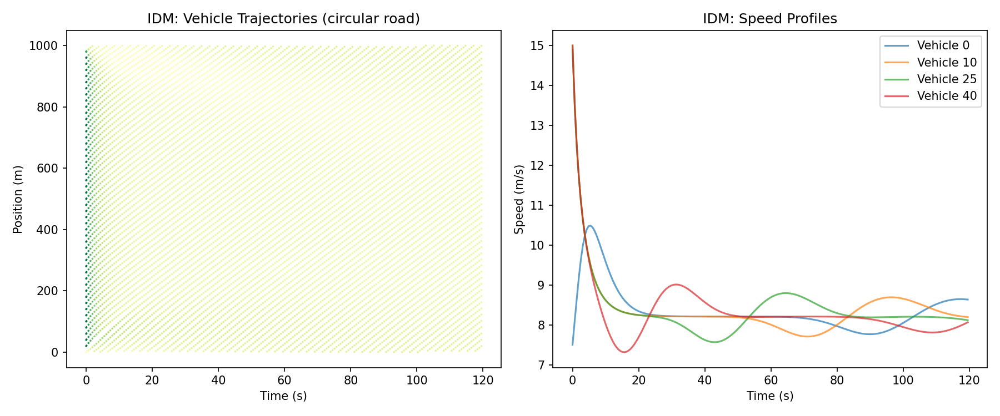
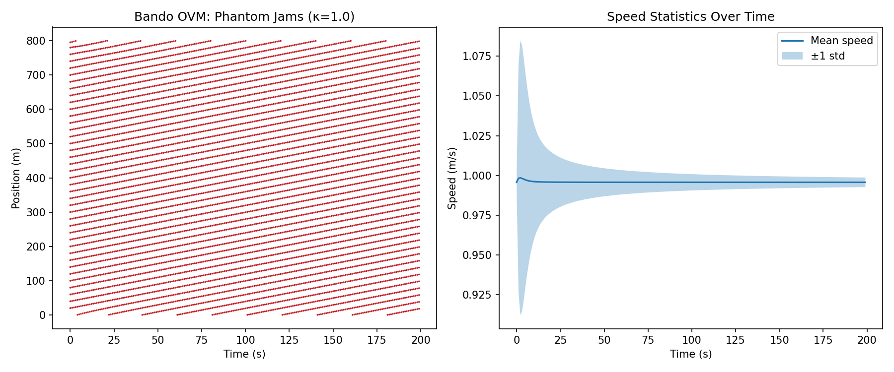
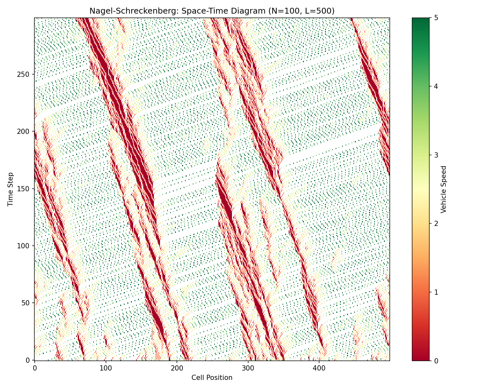
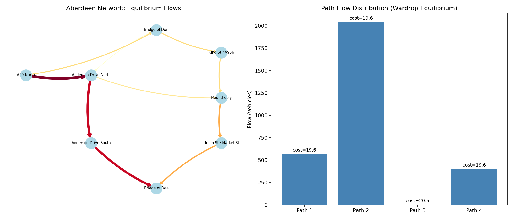
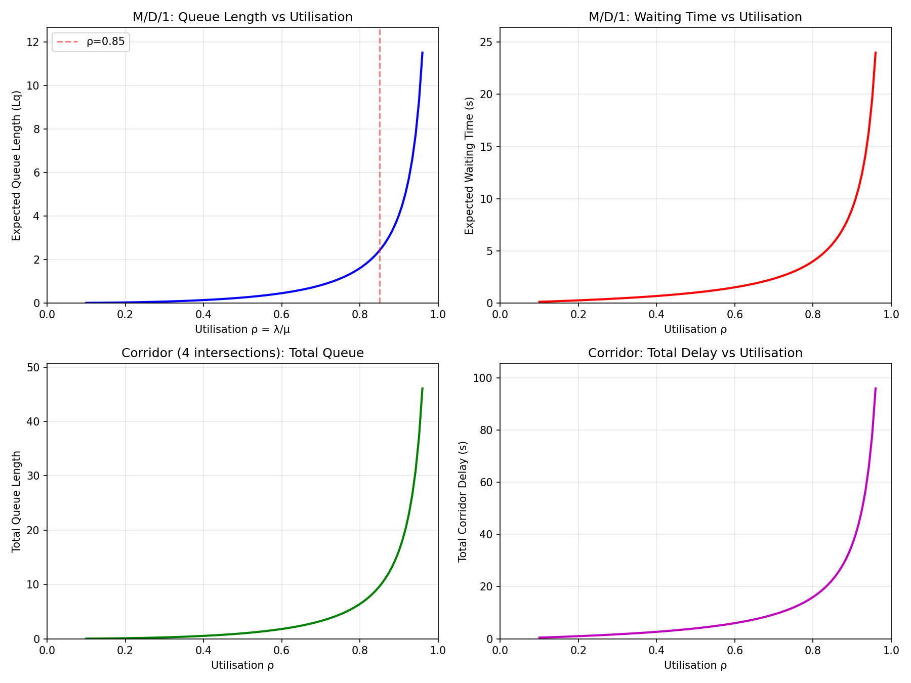

# TrafficJAms: Modelling Traffic Jams in Aberdeen

## Animations

### IDM: Phantom Jam on a Circular Road

35 vehicles following the Intelligent Driver Model on a ring road. A single braking perturbation amplifies through the platoon, creating a backward-propagating phantom traffic jam. Cars coloured green (free flow) through red (stopped).



---

## Why Aberdeen?

Aberdeen presents distinctive traffic modelling challenges:

- **Limited road network**: geography constrains the city between the Rivers Don and Dee, the North Sea coast, and surrounding hills, creating natural bottlenecks.
- **Bridge dependence**: key pinch points at the Bridge of Don, Bridge of Dee, and King Street/Market Street corridors.
- **The AWPR effect**: the Aberdeen Western Peripheral Route (opened 2018) rerouted strategic traffic but shifted congestion patterns.
- **Tidal commuter flows**: strong directional bias from residential north/south into the city centre and energy-sector business parks.
- **Port and industrial traffic**: heavy goods vehicles serving Aberdeen Harbour and the energy industry mix with commuter traffic.

---

## Mathematical Modelling Approaches

### 1. Macroscopic (Continuum) Models

Treat traffic as a fluid and model aggregate density, flow, and velocity.

**LWR Model (Lighthill-Whitham-Richards)**

The foundational first-order hyperbolic PDE:

$$\frac{\partial \rho}{\partial t} + \frac{\partial}{\partial x}\bigl(Q(\rho)\bigr) = 0$$

where $\rho(x,t)$ is vehicle density and $Q(\rho) = \rho \, v(\rho)$ is the flow-density relation (fundamental diagram). Shockwave formation corresponds to jam onset.

*Aberdeen application*: model jam propagation along single-corridor routes like King Street (A956) or the A90 approach to the Bridge of Don.

**Payne-Whitham (second-order) Model**

Adds a momentum equation with an anticipation/pressure term:

$$\frac{\partial v}{\partial t} + v\frac{\partial v}{\partial x} = \frac{V_e(\rho) - v}{\tau} - \frac{c_0^2}{\rho}\frac{\partial \rho}{\partial x}$$

where $V_e(\rho)$ is the equilibrium speed-density relation, $\tau$ is a relaxation time, and $c_0$ controls driver anticipation. Better captures stop-and-go waves.

*Aberdeen application*: model the oscillatory congestion on the A90/A96 merge zones where drivers react to downstream queues.

---

### 2. Microscopic (Car-Following) Models

Simulate individual vehicle dynamics; useful for detailed intersection and merge studies.

**Intelligent Driver Model (IDM)**

$$\dot{v}_\alpha = a\left[1 - \left(\frac{v_\alpha}{v_0}\right)^\delta - \left(\frac{s^*(v_\alpha, \Delta v_\alpha)}{s_\alpha}\right)^2\right]$$

$$s^*(v, \Delta v) = s_0 + vT + \frac{v\,\Delta v}{2\sqrt{ab}}$$

where $v_0$ is desired speed, $s_0$ is minimum gap, $T$ is safe time headway, $a$ and $b$ are acceleration/braking parameters.

*Aberdeen application*: simulate individual vehicle behaviour at the Anderson Drive / A90 junction or roundabouts like the Haudagain.

**Optimal Velocity Model (Bando)**

$$\dot{v}_\alpha = \kappa\bigl[V_{\mathrm{opt}}(s_\alpha) - v_\alpha\bigr]$$

Simple but captures spontaneous jam formation via Hopf bifurcation when sensitivity $\kappa$ is in a critical range.

---

### 3. Network / Graph-Theoretic Models

Aberdeen's road network as a directed graph $G = (V, E)$ with nodes (junctions) and edges (road segments).

**Static Traffic Assignment (Wardrop Equilibrium)**

Find link flows $\mathbf{x}$ such that all used routes between each OD pair have equal (and minimal) cost:

$$c_p = c_q \quad \forall \text{ used paths } p,q \text{ between the same OD pair}$$

Solved via convex optimisation (Beckmann formulation):

$$\min_{\mathbf{x}} \sum_{e \in E} \int_0^{x_e} t_e(\omega)\,d\omega$$

subject to flow conservation and non-negativity. Link cost functions typically follow the **BPR formula**:

$$t_e(x_e) = t_e^0 \left[1 + \alpha\left(\frac{x_e}{C_e}\right)^\beta\right]$$

*Aberdeen application*: evaluate how closing or upgrading a single link (e.g., Union Street bus gates) redistributes flow across the entire network. Quantify the Braess paradox potential in Aberdeen's constrained topology.

**Dynamic Traffic Assignment (DTA)**

Extends the above to time-varying demands and link travel times; models rush-hour wave propagation across the network.

---

### 4. Cellular Automaton Models

**Nagel-Schreckenberg Model**

Discrete space-time-velocity model on a 1D lattice. At each time step:

1. **Acceleration**: $v \leftarrow \min(v+1,\, v_{\max})$
2. **Braking**: $v \leftarrow \min(v,\, d-1)$ where $d$ is gap to next car
3. **Randomisation**: with probability $p$, $v \leftarrow \max(v-1,\, 0)$
4. **Movement**: advance $v$ cells

*Aberdeen application*: fast simulation of phantom jam emergence on long stretches (A90 dual carriageway). Easy to extend to multi-lane with lane-changing rules. The stochastic element captures realistic driver variability.

---

### 5. Queueing-Theoretic Models

Model intersections and bottlenecks as queueing systems.

**M/D/1 or M/G/1 queues** for signalised junctions: vehicles arrive as a Poisson process (rate $\lambda$), service time is the green phase allocation, and the queue length $L_q$ follows:

$$L_q = \frac{\rho^2}{2(1-\rho)} \quad \text{(M/D/1)}$$

where $\rho = \lambda / \mu$ is the utilisation.

**Tandem / network queues**: chain multiple intersections (e.g., the sequence of traffic lights along Union Street or King Street) as a Jackson network to analyse spillback and blocking.

*Aberdeen application*: optimise signal timings along the Market Street / Guild Street corridor; quantify delays at the Beach Boulevard / Esplanade signals.

---

### 6. Stochastic and Data-Driven Approaches

**Mean-field game (MFG) models**: each driver minimises their own cost functional coupled to the population density:

$$\partial_t u + H(x, \nabla u) = \epsilon \Delta u + F(\rho)$$
$$\partial_t \rho - \nabla \cdot (\rho \, \nabla_p H) = \epsilon \Delta \rho$$

Useful for modelling route-choice equilibria with many interacting agents.

**Bayesian traffic state estimation**: fuse sparse sensor data (e.g., SCOOT loop detectors on Aberdeen's signal network, Google/Waze travel times) with model predictions via Kalman filtering or particle filters to estimate real-time density fields.

**Machine learning surrogates**: train neural networks on simulation outputs or historical data (e.g., Traffic Scotland / Aberdeen City Council open data) to provide fast traffic state prediction for scenario testing.

---

### 7. Suggested Starting Points for Aberdeen

| Approach | Best suited for | Data needs |
|---|---|---|
| LWR / Payne-Whitham | Corridor-level jam propagation (A90, A96) | Flow-density measurements at a few points |
| IDM simulation | Junction/roundabout design (Haudagain, Bridge of Don) | Turning counts, signal plans |
| Nagel-Schreckenberg CA | Quick scenario testing, phantom jam statistics | Approximate flow rates |
| Network assignment | City-wide route redistribution, policy evaluation | OD demand matrix, link capacities |
| Queueing models | Signal optimisation on arterial corridors | Arrival rates, signal timing plans |
| MFG / data-driven | Real-time prediction, route guidance | Sensor/GPS trace data |

---

## Key Aberdeen Data Sources

- **Aberdeen City Council** traffic count and signal data
- **Traffic Scotland** real-time and historical journey time data
- **Transport Scotland** STATS19 accident records and traffic surveys
- **OpenStreetMap** road network geometry for graph extraction
- **Uber Movement / Google Environmental Insights** travel time datasets

---

## Simulation Results

All models are implemented in the `trafficjams/` package. Run with:

```bash
pip install -r requirements.txt
python -m simulations.run_all
```

### LWR Model — Jam Propagation on A90-like Corridor



The Godunov scheme resolves shockwave propagation from an initial high-density block. The upstream shock travels backward (visible as the leftward-moving density front) while a rarefaction wave fans out downstream — classic LWR behaviour matching the Greenshields fundamental diagram.

### Payne-Whitham — Stop-and-Go Waves at Merge Zone



The second-order model with anticipation term captures stop-and-go oscillations near the merge zone. Unlike the first-order LWR, the momentum equation allows velocity to deviate from equilibrium, producing richer wave structures.

### Intelligent Driver Model — Spontaneous Jam on Circular Road



50 vehicles on a 1km circular road. A small initial speed perturbation on one vehicle amplifies through the platoon, producing a persistent traffic jam that propagates backward — the classic "phantom jam" phenomenon. Speed profiles show oscillatory convergence.

### Bando OVM — Phantom Jams via Hopf Bifurcation



The Optimal Velocity Model demonstrates how uniform flow becomes unstable when the sensitivity parameter κ lies in a critical range. The mean speed drops and speed variance increases as the system evolves into stop-and-go waves.

### Nagel-Schreckenberg — Cellular Automaton Space-Time Diagram



The stochastic CA model produces realistic jam patterns on a 500-cell lattice with 100 vehicles. Backward-propagating jam waves (dark diagonal bands) emerge spontaneously from the random braking rule — a hallmark of the NaSch model.

### Network Assignment — Wardrop Equilibrium on Aberdeen Network



Beckmann formulation solved with BPR cost functions on an 8-node Aberdeen-inspired network. At equilibrium, used paths have approximately equal costs (Wardrop's first principle). Path 2 (Anderson Drive) carries the most flow due to higher capacity.

### M/D/1 Queueing — Signalised Corridor Delays



Queue length and delay grow nonlinearly with utilisation, approaching infinity as ρ → 1. A 4-intersection corridor (modelling Union Street or King Street) shows how delays compound through multiple signals. The ρ = 0.85 threshold marks typical onset of severe congestion.

---

## References

- Lighthill, M.J. & Whitham, G.B. (1955). *On kinematic waves II: A theory of traffic flow on long crowded roads.* Proc. Royal Society A, 229(1178).
- Treiber, M. & Kesting, A. (2013). *Traffic Flow Dynamics.* Springer.
- Nagel, K. & Schreckenberg, M. (1992). *A cellular automaton model for freeway traffic.* J. Phys. I France, 2(12).
- Wardrop, J.G. (1952). *Some theoretical aspects of road traffic research.* Proc. ICE, 1(3).
