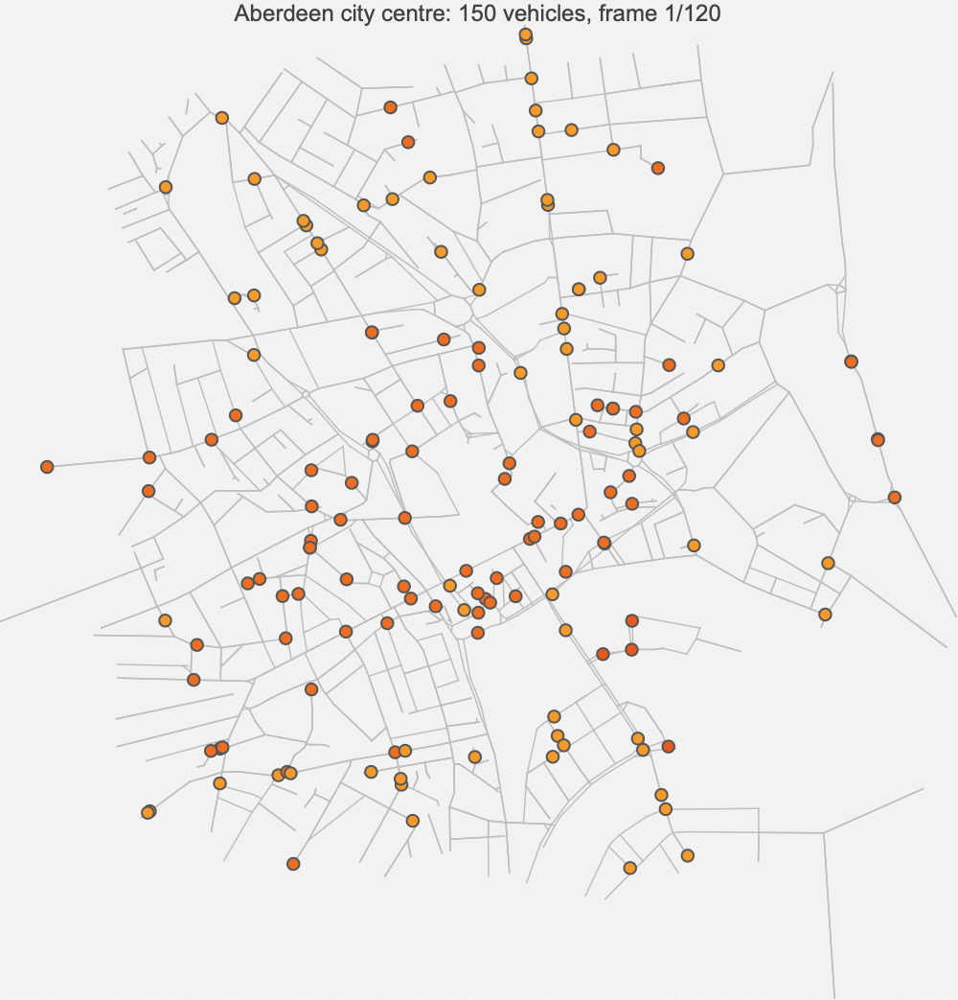
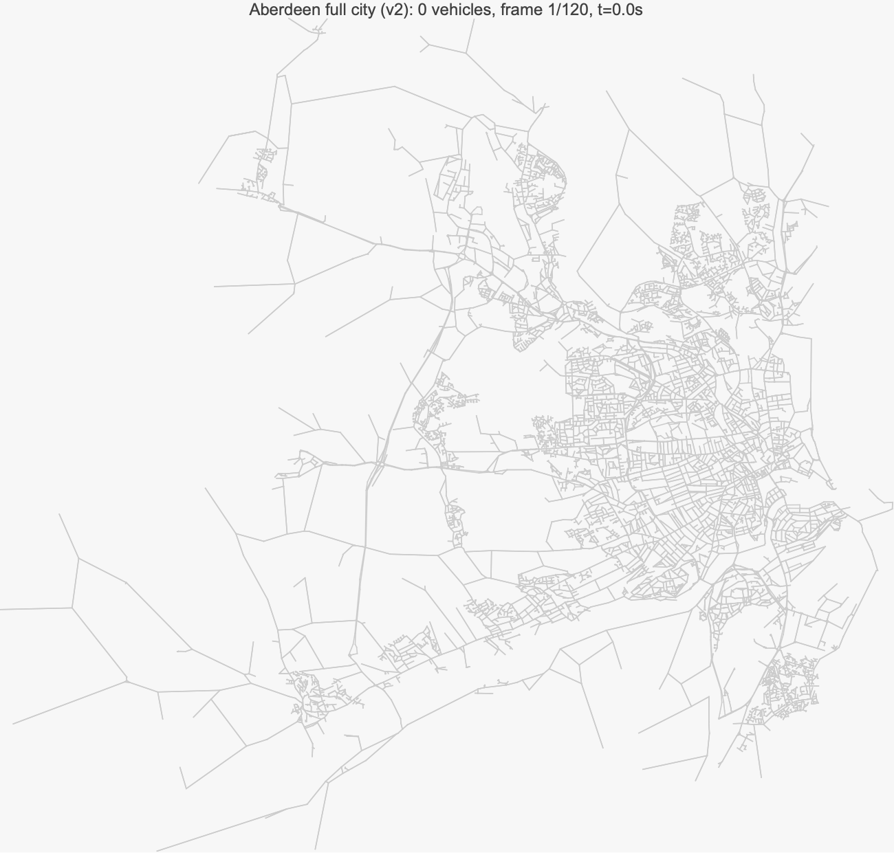

# TrafficJAms — Wolfram Language Port

This directory contains a Wolfram Language (Mathematica) port of the traffic-flow
models implemented in the Python `trafficjams/` package. Each `.wl` file is a
standalone package that mirrors one model:

| File                              | Model                                    |
|-----------------------------------|------------------------------------------|
| `IDM.wl`                          | Intelligent Driver Model (microscopic)   |
| `Bando.wl`                        | Optimal Velocity Model (Bando)           |
| `LWR.wl`                          | Lighthill–Whitham–Richards (Godunov)     |
| `PayneWhitham.wl`                 | Payne–Whitham second-order PDE           |
| `NagelSchreckenberg.wl`           | Nagel–Schreckenberg stochastic CA        |
| `NagelSchreckenberg2Lane.wl`      | Two-lane NaSch with lane-changing        |
| `Queueing.wl`                     | M/D/1 signalised-corridor queue          |
| `SignalOptimisation.wl`           | Webster delay-minimising green splits    |
| `IntersectionControl.wl`          | Signal controller + roundabout gap model |
| `NetworkAssignment.wl`            | Beckmann / BPR Wardrop equilibrium       |
| `DynamicAssignment.wl`            | Time-varying demand, period-by-period UE |
| `AberdeenNetwork.wl`              | 15-node Aberdeen Wardrop network         |
| `AberdeenCityNetwork.wl`          | Multi-agent sim on real Aberdeen OSM     |
| `AberdeenFullCity.wl`             | Full-city v2 sim (signals + roundabouts) |
| `RunAll.wls`                      | Runs every model and exports PNGs        |

## Running

All files can be evaluated from a notebook, or run headless with
`wolframscript`:

```
wolframscript -file RunAll.wls
```

Output images are written to `results/`. Each package also defines a
`Simulate<Name>[]` function and a `Plot<Name>[result]` function so individual
models can be explored interactively.

## Results

Each model exports a PNG into `results/`:

| Model | Output |
|-------|--------|
| IDM circular road | `results/idm.png` |
| Bando OVM | `results/bando.png` |
| LWR / Godunov | `results/lwr.png` |
| Payne-Whitham | `results/payne_whitham.png` |
| Nagel-Schreckenberg | `results/nagel_schreckenberg.png` |
| NaSch 2-lane | `results/nasch_2lane.png` |
| M/D/1 queueing | `results/queueing.png` |
| Signal optimisation | `results/signal_optimisation.png` |
| Signal phase schedule (demo) | `results/signal_schedule.png` |
| Network assignment | `results/network_assignment.png` |
| Dynamic assignment | `results/dynamic_assignment.png` |
| Aberdeen Wardrop network | `results/aberdeen_network.png` |
| Aberdeen city multi-agent | `results/aberdeen_city.png` |
| Aberdeen city animation | `results/aberdeen_city.gif` |
| Aberdeen full city v2 | `results/aberdeen_full.png` |
| Aberdeen full city v2 animation | `results/aberdeen_full.gif` |

### Aberdeen city animation



### Aberdeen full city v2 animation

600 vehicles on the full Aberdeen drivable road network with full IDM
car-following, 151 signalised junctions, ~1000 roundabout-tagged edges,
hierarchy-weighted noisy routing, staggered entry over 60 s, and
probabilistic detours.



## Notes on the port

* The Wolfram versions are intentionally faithful to the Python reference in
  parameter choices and numerical schemes, so results should match up to
  floating-point noise.
* Where Python loops compute things element-wise we use vectorised primitives
  (`MapThread`, `Mod`, matrix-vector products) — the logic is the same.
* Plots use `ArrayPlot` / `ListDensityPlot` / `ListLinePlot`; they mirror the
  matplotlib figures in `results/` at the top level of the repo.
